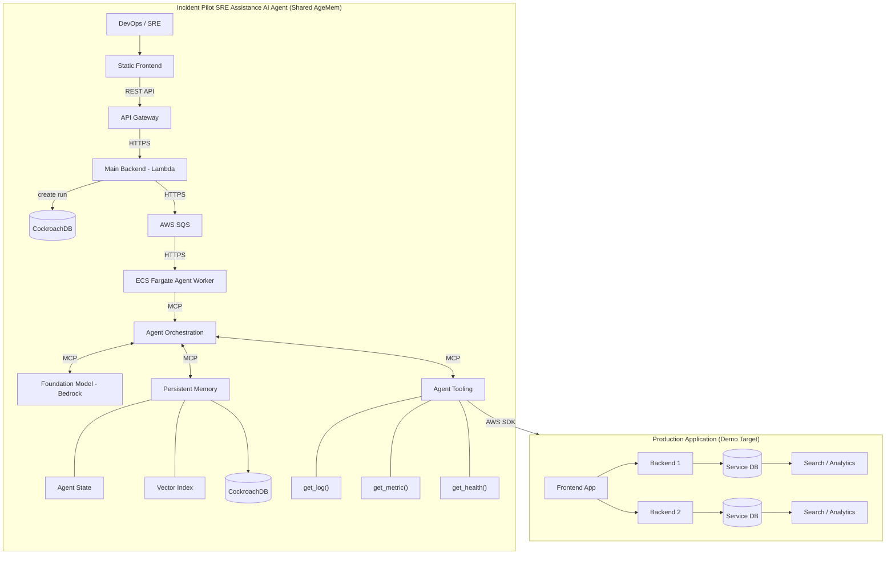
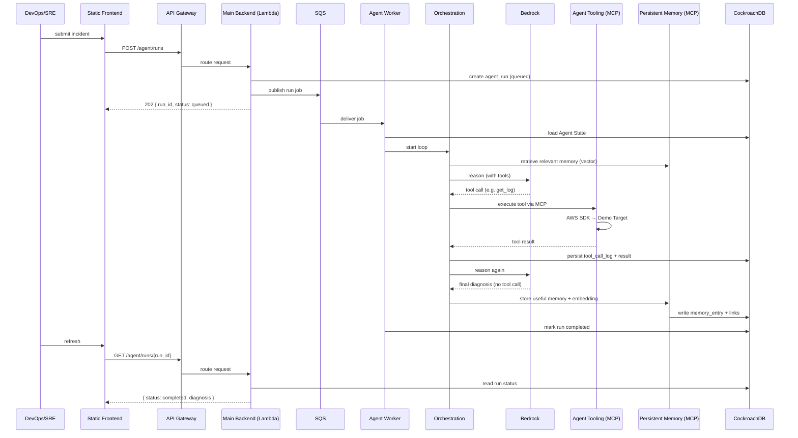

# Incident Pilot Backend

AI-powered SRE incident investigation agent. The Agent observes a **Production Application (the demo target)**, retrieves historical incident knowledge from **Shared AgeMem**, reasons over the incident with a foundation model (Claude / Nova via AWS Bedrock), inspects infrastructure through an **MCP** tool layer, and stores new operational knowledge for future incidents.

> **Design and architecture specification (V1).** No production code is implemented yet — this document is the source of truth for the implementation phase. It is aligned with `Architecture.png` at the repo root.

## Core Agent Loop

```text
Observe → Retrieve → Reason → Tool Call → Observe → ... → Store
```

A single investigation may last **5–20 minutes** and involve many Bedrock calls and many tool calls. Every architecture decision below exists to support that reality.

## The Two Tiers

The system has two clearly separated tiers (see `Architecture.png`):

- **Incident Pilot SRE Assistance AI Agent** — the Agent platform. This is what this backend implements. It includes the API entrypoint, the async execution path, the Agent Orchestrator, Persistent Memory (**Shared AgeMem**), and Agent Tooling.
- **Production Application (Demo Target)** — a *separate* sample production environment being investigated. It is **not** part of the Agent platform. It has its own Frontend App, backends (Lambda), Service DBs, and Search/Analytics. The Agent reads its logs, metrics, and health state — it never becomes part of it.

```text
┌─────────────────────────────────────────────────────────────┐
│  Incident Pilot SRE Assistance AI Agent  (Shared AgeMem)    │
│                                                             │
│  Static Frontend → API Gateway → Main Backend (Lambda)      │
│       → AWS SQS → ECS Fargate Agent Worker                  │
│             → Agent Orchestration                           │
│                   ├── Foundation Model (Bedrock)            │
│                   ├── Persistent Memory  (MCP)              │
│                   └── Agent Tooling      (MCP)              │
│                             │ AWS SDK                       │
└─────────────────────────────┼───────────────────────────────┘
                              ▼
┌─────────────────────────────────────────────────────────────┐
│  Production Application (Demo Target)                       │
│  Frontend App · Backend 1/2 · Service DB · Search/Analytics │
└─────────────────────────────────────────────────────────────┘
```

The Agent Tooling crosses the tier boundary using the **AWS SDK** to read logs/metrics/health from the demo target. The demo target exposes no Agent-specific code — it is simply observed.

## Stack

- **Python** + **FastAPI** — application runtime (Main Backend, Agent Worker)
- **AWS Bedrock** — foundation model reasoning (Claude / Nova)
- **Amazon SQS** — async execution boundary
- **Amazon ECS Fargate** — long-running Agent Worker
- **AWS Lambda** + **API Gateway** — public API entrypoint only
- **Static Frontend** — DevOps/SRE UI (S3 + CloudFront-style hosting)
- **CockroachDB** — persistent application state (Agent State + relational memory)
- **Vector Index** — semantic retrieval for Shared AgeMem (cost-efficient V1 choice, see Memory)
- **MCP (Model Context Protocol)** — protocol boundary for tooling and memory access
- **Amazon CloudWatch** — observability / incident data source in the demo target
- **Docker** — local dev and container build

> Cost discipline: this stack intentionally avoids extra managed services beyond what the diagram requires. No standalone managed vector DB, no additional orchestration services, no streaming buses. See *Cost & MVP Posture*.

## Critical Architecture Decision: Lambda is not the Orchestrator

> **Lambda is an API/command submission layer, not the Agent Orchestrator.**

Agent execution is long-running and dynamic. A single run performs many Bedrock calls and tool calls, often taking 5–20 minutes. Lambda's invocation lifecycle and timeout (15 min hard cap) are incompatible with that pattern.

Responsibilities are split:

- **Lambda (Main Backend)** only validates the request, creates a run, submits a job to SQS, and returns `202 Accepted`. It never executes the reasoning loop.
- **ECS Fargate** hosts the long-running Agent Worker that owns the loop. It is decoupled from the request lifecycle via SQS, so its execution time is bounded by the run, not by Lambda.

### Request Path (V1)

```text
DevOps/SRE
  ↓
Static Frontend
  ↓ (REST API / HTTPS)
API Gateway            ← public API boundary
  ↓
Main Backend (Lambda)  ← thin command-submission layer
  ↓ (HTTPS)
AWS SQS                ← async execution boundary
  ↓ (HTTPS)
ECS Fargate Agent Worker
  ↓ (MCP)
Agent Orchestration
  ├── Foundation Model (Bedrock)
  ├── Persistent Memory   (via MCP)
  └── Agent Tooling       (via MCP → AWS SDK → Demo Target)
```

A single execution:

```text
Observe
  ↓
Retrieve Memory
  ↓
Bedrock Reasoning
  ↓
Tool Call?
  ├── Yes → Execute Tool (via MCP) → Observe Again (loop)
  └── No  → Store Memory → Complete
```

## Responsibilities

### Static Frontend

The DevOps/SRE UI. Calls the Main Backend through API Gateway over REST/HTTPS. Pure client; contains no Agent logic.

### API Gateway

The **public API boundary**. Owns routing, authN/authZ at the edge, request throttling, and request/response transformation. It fronts the Main Backend Lambda. It performs **no** Agent execution.

### Main Backend (Lambda)

1. Validate the request.
2. Create an `agent_session` / `agent_run` record in CockroachDB.
3. Publish an Agent Run job to SQS.
4. Return `202 Accepted`.

It must **not** execute the Agent reasoning loop.

```http
POST /agent/runs          → 202 { run_id, session_id, status: "queued" }
GET  /agent/runs/{run_id} → run status
```

Run statuses: `queued · running · waiting_for_tool · completed · failed · cancelled`

### SQS

The asynchronous execution boundary between the short-lived API and the long-running worker. Provides:

- **decoupling** — API returns immediately; worker consumes at its own pace.
- **buffering** — submission spikes queue without overwhelming workers.
- **retry** — failed deliveries reappear on the queue.
- **failure recovery** — visibility timeout + DLQ for poison messages.
- **workload smoothing** — concurrency governed by queue depth and worker count.

**Idempotency.** SQS may deliver the same message more than once. Every job is keyed by `run_id` and processed idempotently: re-processing a run that has already progressed resumes from persisted state rather than restarting it. The worker acquires the run only if its status is still `queued`; an already-`running` run is skipped.

### ECS Fargate Agent Worker

Hosts the long-running Agent Worker:

- consume Agent Run jobs from SQS
- load persistent run state (Agent State) from CockroachDB
- execute the Agent loop via Agent Orchestration
- call Bedrock
- execute tools **through the MCP layer**
- retrieve and store memories **through the MCP layer**
- update run status
- handle failures and retries

The worker is **stateless at the process level** — all persistent state lives in CockroachDB, so any container can be replaced or scaled without losing a run.

## Agent Orchestration

An application-level component that owns the Agent execution loop. It is **not a fixed pipeline** — the foundation model decides the next tool dynamically via tool calling. There is no hardcoded sequence such as `CloudWatch Logs → Metrics → EC2`.

```text
Load Run
  ↓
Retrieve Relevant Memory      (via MCP → Persistent Memory)
  ↓
Observe System
  ↓
Reason with Bedrock
  ↓
Does the model request a tool?
  ├── Yes → Validate Tool Call → Execute Tool (via MCP) → Persist Tool Result → Reason Again (loop)
  └── No  → Generate Final Diagnosis → Store Useful Memory → Mark Run Completed
```

## MCP: the Protocol Boundary

> **MCP is a V1 architecture decision, not aspirational.**

The Agent Orchestrator talks to two kinds of capability through **MCP (Model Context Protocol)**: tools and memory. The LLM **must not** access AWS infrastructure or memory storage directly — every external interaction is mediated by the MCP layer.

```text
Agent Orchestration
   │  (MCP)
   ├──► Agent Tooling          → get_log(), get_metric(), get_health() → AWS SDK → Demo Target
   └──► Persistent Memory      → Agent State · Vector Index (Shared AgeMem)
```

Why MCP:

- **one protocol boundary** for both tools and memory — consistent discovery, schema, authorization, and audit.
- **isolation** — the orchestrator depends on MCP interfaces, never on AWS SDKs or DB drivers directly.
- **swappability** — tools and memory backends can be added, replaced, or mocked behind the same protocol.

V1 MCP surface (concrete tools exposed through the layer):

```text
get_log()      — retrieve logs from the Production Application (Demo Target)
get_metric()   — retrieve metrics from the Demo Target
get_health()   — check service health of the Demo Target
```

The tool layer enforces, for every MCP tool call:

- **explicit input schemas** — validated before execution.
- **validation** — reject malformed or unsafe arguments.
- **authorization** — each call checked against allowed scope.
- **timeout handling** — no tool may hang the run indefinitely.
- **error handling** — failures return structured results to the LLM, not crashes.
- **audit logging** — every invocation recorded in `tool_call_logs`.

> Additional tools (e.g. `RunbookTool`, `AWSResourceInspectionTool`, `MemorySearchTool`) are **future/optional** and slot in as additional MCP-exposed tools without redesign.

## Persistent Memory (Shared AgeMem)

Persistent Memory is the **Shared AgeMem** — long-term incident knowledge carried across runs and sessions, plus the Agent State of in-flight runs. It is accessed by the orchestrator **via MCP**.

Initial relational data model (CockroachDB):

```text
agents
agent_sessions
agent_runs
session_messages
tool_call_logs
memory_entries
memory_links
```

Concepts:

- **session** — conversation context.
- **run** — one Agent execution within a session.
- **memory** — long-term knowledge carried across runs and sessions.
- **tool_call_log** — tool execution / audit history.
- **Agent State** — the persisted, resumable state of a run (loop position, last observation, partial trace).

`memory_links` is a **self-referencing** relationship between `memory_entries`, typed:

```text
Memory A
  ├── related_to ──→ Memory B
  ├── derived_from ─→ Memory C
  ├── contradicts ──→ Memory D
  └── supersedes ──→ Memory E
```

### Vector Index (committed for V1)

> **Vector search is a V1 commitment**, not deferred.

Persistent Memory includes a **vector index** for semantic retrieval. Each `memory_entry` carries an embedding populated at write time; retrieval is similarity-based over those embeddings.

Cost-efficient V1 approach — **avoid an expensive managed vector database**:

- The **storage and retrieval implementation is hidden behind an abstraction** (a `MemoryRepository` / vector-store port in the memory domain).
- V1 default implementation: store embeddings **alongside the relational data** (e.g. embeddings in CockroachDB or a lightweight local index) and perform similarity search in-process. This is sufficient for an MVP/demo corpus and avoids a separate managed vector DB.
- Because the implementation sits behind a port, it can be **swapped later** (e.g. to pgvector, an in-memory ANN index, or a managed store) without changing the domain model or the MCP surface.

> The choice of the *specific* vector backend is intentionally the one place left flexible — but a vector index of *some* kind is part of V1.

## Failure Handling and Resume

The system assumes an ECS worker can crash at any time. Therefore **all Agent execution state is persisted in CockroachDB** (Agent State), and SQS provides retry and recovery.

| Failure                  | Handling                                                                                          |
| ------------------------ | ------------------------------------------------------------------------------------------------- |
| Worker crash             | Run state is in CockroachDB. SQS redelivers the job; a new worker loads state and resumes.         |
| Bedrock timeout          | Retry with backoff; after N attempts the run is marked `failed` with the partial trace intact.   |
| Tool timeout             | MCP tool returns a structured timeout result; the LLM may retry or pick another tool.            |
| Tool failure             | Structured error returned to the LLM via MCP; logged in `tool_call_logs`. Does not crash the run. |
| Duplicate SQS delivery   | Idempotent by `run_id`; a run already `running` is skipped.                                       |
| Partial Agent execution  | Each step (observation, tool result, memory write) is persisted before the next; a crash mid-loop loses at most one in-flight step. |
| Retry                    | Bounded retries with backoff; persistent progress prevents re-running completed steps.            |
| Idempotency              | `run_id` is the dedup key; tool calls are idempotent by `(run_id, step)` and de-duplicated.       |
| Failed runs              | Marked `failed`; partial trace + diagnosis retained in CockroachDB for review and re-run.         |

Goal: recover an Agent Run without losing persistent state. The run is resumable because every transition is recorded before it is acted on.

## Security Model

Incident Pilot V1 is **read-only and recommendation-first.**

The Agent may:

- inspect CloudWatch / logs / metrics / health of the Demo Target
- inspect AWS resources
- retrieve runbooks
- retrieve historical incidents (Shared AgeMem)
- analyze incidents
- provide recommendations

The Agent should **not** automatically perform destructive remediation.

Principles:

- **least-privilege IAM**
- **read-only AWS permissions by default**
- **strict tool input validation** at the MCP layer
- **explicit tool authorization** — each MCP call checked against allowed scope
- **audit logging** — every tool invocation recorded
- **no destructive actions by default**
- **human approval required** before any future remediation

The architecture is designed so **remediation capabilities can be added later without redesign** — they slot in as additional MCP-exposed tools behind the same authorization gate, with a human-approval port that stays a no-op in V1.

## Clean Architecture / DDD Structure

The project is organized by **business boundary**, not by technical layer.

```text
src/
├── agent/            # the Agent execution loop, orchestration, MCP boundary
│   ├── domain/       # entities, ports, domain services (no AWS/DB/LLM/MCP imports)
│   ├── application/  # use cases: orchestrate run, execute tool, persist state
│   └── infrastructure/ # adapters: Bedrock, SQS consumer, CockroachDB run state,
│                      #            MCP client + MCP server (tool & memory)
│
├── incident/         # incident context: what an incident is, runbooks
│   ├── domain/
│   ├── application/
│   └── infrastructure/
│
├── memory/           # Shared AgeMem: entries, links, vector retrieval + storage
│   ├── domain/       # MemoryRepository port (vector store abstraction)
│   ├── application/
│   └── infrastructure/ # CockroachDB relational store + V1 vector index impl
│
├── observability/    # CloudWatch logs/metrics/health as a tool data source
│   ├── domain/
│   ├── application/
│   └── infrastructure/
│
└── ...               # additional bounded contexts as needed
```

**Avoid** organizing the entire application by technical layer:

```text
# Do NOT do this
services/
repositories/
models/
utils/
```

Module responsibilities:

- **agent** — the execution loop, orchestrator, and MCP boundary (the central bounded context). `domain` defines ports (LLM, Tool/MCP, Memory, RunState); `application` drives the loop; `infrastructure` implements adapters (Bedrock, SQS, MCP client/server, CockroachDB run state).
- **incident** — incident entities and runbook knowledge. Owns what "an incident" means.
- **memory** — Shared AgeMem: `memory_entries` + `memory_links`, vector retrieval and storage. Owns long-term knowledge and the vector-store port.
- **observability** — CloudWatch logs/metrics/health as the tool data source for the Demo Target. Owns the "observe" side of the loop.

Dependency rule: `domain` depends on nothing outward; `application` depends on `domain`; `infrastructure` implements `domain` ports. This keeps the Agent loop testable without AWS, Bedrock, or a real vector store.

## Architecture Diagram

This Mermaid version mirrors `Architecture.png`.



## Agent Execution Sequence



## Architecture Decisions

| Component              | Responsibility                                           |
| ---------------------- | -------------------------------------------------------- |
| Static Frontend        | DevOps/SRE UI                                            |
| API Gateway            | Public API boundary, edge auth, throttling               |
| Main Backend (Lambda)  | Request validation + job submission (thin)               |
| AWS SQS                | Async execution boundary                                 |
| ECS Fargate            | Long-running Agent Worker                                |
| Agent Orchestration    | Agent execution loop                                     |
| Foundation Model       | LLM reasoning (Bedrock: Claude / Nova)                   |
| MCP                    | Protocol boundary for tooling + memory                   |
| Agent Tooling          | `get_log()` / `get_metric()` / `get_health()` via MCP    |
| Persistent Memory      | Shared AgeMem: Agent State + Vector Index                |
| CockroachDB            | Persistent application state                             |
| Vector Index           | Semantic retrieval (cost-efficient V1 impl, behind port) |
| CloudWatch             | Observability / incident data (Demo Target)              |
| Production Application | Demo Target — the system being investigated              |

> Lambda is an API/command submission layer, not the Agent Orchestrator. MCP is the protocol boundary the orchestrator uses for all tools and memory.

## Cost & MVP Posture

Optimized for **low AWS cost** and a **practical MVP/demo**:

- **No extra managed services beyond the diagram.** Specifically no standalone managed vector DB — embeddings live alongside relational data behind a port in V1.
- **ECS Fargate** sized for a small worker count; queue depth governs concurrency so we don't pay for idle capacity.
- **Lambda** kept thin to minimize invocation cost and duration.
- **CockroachDB** serves both run state and relational memory in one store.
- **Vector index** uses the cheapest sufficient backend for a demo corpus, swappable later.

## Local Development

```text
uv run fastapi dev
```

## Scope

This document is **design only**. Not yet implemented:

- Static Frontend
- API Gateway + Lambda (Main Backend)
- ECS Fargate deployment
- Terraform
- Docker production configuration
- database migrations
- Bedrock implementation
- MCP layer (client + server for tools and memory)
- actual tools (`get_log()`, `get_metric()`, `get_health()`)
- Shared AgeMem: relational store + vector index
- Demo Target wiring (read-only observation)

> Future / optional (clearly not V1): remediation tools, additional MCP tools, managed vector DB migration, human-approval-gated actions.

This README is the source of truth for the implementation phase.

## Execution-Time Guarantee

The architecture supports a single Agent execution of **5–20 minutes** with many Bedrock calls and many tool calls, independent of any Lambda timeout: the API Lambda returns `202` within seconds, the run executes on ECS Fargate for as long as needed, and every step is persisted (Agent State) so it survives crashes and resumes via SQS redelivery.
